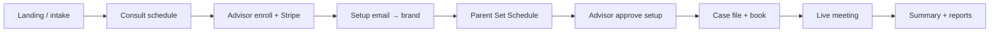

# IEP end-to-end pipeline — manual test guide

Last updated: 2026-07-20  
Apps: **sustainable-website** (funnels + advisor + meeting host) · **iep-user-dashboard** (IEP / Coaching client portal)  
Shared DB: Supabase `cgghmctyygkqzalfhqsx`  
VA Claims stays on the main site — this guide is **IEP-focused** (Coaching notes where it differs).

---

## 0. Mental model

```text
Prospect (marketing)
    → Intake (IEP)
    → Book consultation (schedule)
    → Advisor enrolls + Stripe
    → Setup email → IEP user dashboard password
    → Parent Set Schedule (milestone + IEP draft)
    → Advisor reviews / approves setup
    → Parent uses Case file + books sessions
    → Live meeting (guest + host)
    → Post-call family summary
    → Ongoing messages / reports / extras
```

| App | Role | Local URL |
|-----|------|-----------|
| `sustainable-website` | Marketing, intake, consult booking, advisor portal, Stream host/guest meeting | http://localhost:3000 |
| `iep-user-dashboard` | Parent / client portal after enrollment | http://localhost:3001 |

---

## 1. Local prerequisites

### Run both apps

```bash
# Terminal 1 — website + advisor + meetings
cd ../sustainable-website && npm run dev   # :3000

# Terminal 2 — client portal
cd iep-user-dashboard && npm run dev                    # :3001
```

### Env checklist

**sustainable-website**

| Variable | Local value / note |
|----------|--------------------|
| `CLIENT_PORTAL_URL` or `NEXT_PUBLIC_CLIENT_PORTAL_URL` | `http://localhost:3001` |
| Supabase URL + anon + service role | Same project as brand |
| Stripe secret + webhook secret | Enrollment checkout |
| Resend / email | Welcome + coach message emails |
| Stream / Copilot keys | Live meetings |

**iep-user-dashboard**

| Variable | Local value / note |
|----------|--------------------|
| App port | `3001` |
| `NEXT_PUBLIC_MEETING_BASE_URL` or `MEETING_BASE_URL` | `http://localhost:3000` |
| Same Supabase keys | Auth + portal data |
| Stripe + webhook | Extra session (`portal_session_booking`) |

**Supabase Auth → Redirect URLs allowlist**

- `http://localhost:3001/auth/confirm`
- `http://localhost:3001/auth/callback`

**Stripe CLI (local webhooks)**

```bash
# Enrollment (website)
stripe listen --forward-to localhost:3000/api/stripe/webhook

# Extra sessions (brand) — second terminal / second endpoint as needed
stripe listen --forward-to localhost:3001/api/stripe/webhook
```

### Accounts you need

| Role | How to get it |
|------|----------------|
| **IEP advisor** | Verified advisor with `primary_program = iep`, availability set, Stripe catalog seeded |
| **IEP parent** | Created by enrollment (unique email), or full funnel below |
| Optional **Coaching** client | Same enroll path with coaching plan — regression only |

---

## 2. Pipeline map (phases)



---

## 3. Phase A — Funnel entry (prospect)

**Goal:** Prospect starts IEP intake and lands on consultation booking.

| # | Action | URL | Pass if |
|---|--------|-----|---------|
| A1 | Open IEP landing | http://localhost:3000/iep-services | Page loads |
| A2 | Start intake | http://localhost:3000/intake/iep | Wizard opens (`iep` is a valid intake service) |
| A3 | Complete intake | (wizard) | Redirects to schedule |
| A4 | Land on consult booking | http://localhost:3000/schedule/iep | “Book an IEP Consultation” (or equivalent) |

**Also valid entry points**

- Programs / assessment CTAs → `/intake/iep`
- Public advisor profile `http://localhost:3000/{slug}` → intake with preferred advisor

**Skip path for speed:** If you only care about portal + enrollment, jump to **Phase C** and enroll a new email from the advisor UI.

---

## 4. Phase B — Consultation scheduling

**Goal:** A consult appointment exists for an IEP advisor.

| # | Action | URL | Pass if |
|---|--------|-----|---------|
| B1 | Pick advisor + slot | `/schedule/iep` | Slot confirms |
| B2 | Advisor sees appointment | http://localhost:3000/advisor/schedule | Row appears (IEP: table first; **View calendar** for calendar) |
| B3 | Optional: open calendar | `/advisor/schedule/calendar` | Same appointment visible |
| B4 | Optional: open from meeting card | Schedule / calendar → client details | Opens `/advisor/users/{userId}` when linked |

**Gate:** Advisors must be verified and have availability, or the schedule list will be empty.

---

## 5. Phase C — Advisor enrollment + Stripe

**Goal:** Paid enrollment creates auth user, `advisor_enrollments`, session grants, and welcome/setup email.

| # | Action | URL | Pass if |
|---|--------|-----|---------|
| C1 | Open Enrollment | http://localhost:3000/advisor/enroll | Form loads |
| C2 | Prefill from appointment (optional) | `/advisor/enroll?appointmentId={id}` | Client fields prefilled when available |
| C3 | Choose IEP plan | Form | e.g. Review & Feedback ($1,497 / 2 sessions), Onsite ($1,797 / 2), Full Year ($2,497 / 12) |
| C4 | Complete Stripe Checkout | Stripe test card `4242…` | Success page |
| C5 | Success return | `/advisor/enroll/success?session_id=…` | Shows success |
| C6 | Confirm DB / UI | My Users | New client listed |

**Expected side effects**

- `profiles.service_type = iep`
- `advisor_enrollments.sessions_included` set (IEP default **2** if catalog unset)
- Welcome email with **iep-user-dashboard** setup link (`CLIENT_PORTAL_URL`)

**Fail clues**

- Wrong portal URL in email → check `CLIENT_PORTAL_URL`
- No enrollment row → Stripe webhook not hitting website
- Sessions = 0 unexpectedly → catalog metadata / session-grants logic

---

## 6. Phase D — Password setup → IEP user dashboard

**Goal:** Parent can sign into brand on `:3001`.

| # | Action | URL | Pass if |
|---|--------|-----|---------|
| D1 | Open setup link from email | `{portal}/auth/confirm?token_hash=…&type=recovery&next=/update-password` | Session established |
| D2 | Set password | http://localhost:3001/update-password | Password saves |
| D3 | Login | http://localhost:3001/login | Lands on `/dashboard` |

**If email is unavailable locally:** copy the link from Resend logs / server logs, or generate via advisor **Reset password** on My Users detail after first enroll.

---

## 7. Phase E — Parent “Set Schedule” (portal onboarding)

**Goal:** Parent completes brand setup (milestone + IEP draft) and submits for advocate review.

| # | Action | URL | Pass if |
|---|--------|-----|---------|
| E1 | Open setup | http://localhost:3001/setup | Welcome / name |
| E2 | Milestone | `/setup/milestone` | Meeting date + type (incl. Review ARD / MDARD / STAAR-related types) |
| E3 | Documentation | `/setup/documentation` | Upload IEP draft PDF + submit |
| E4 | Waiting state | same flow | Status waiting / under review UI |
| E5 | Nav | Sidebar | **Set Schedule** hides after submit |

**Status chain:** `draft` → `submitted` → `under_review` → `approved` | `needs_changes`

---

## 8. Phase F — Advisor reviews setup

**Goal:** Advisor approves (or requests changes); parent sees result.

| # | Action | URL | Pass if |
|---|--------|-----|---------|
| F1 | Open My Users | http://localhost:3000/advisor/users | Client row; **Verified / Not verified** for IEP |
| F2 | Open detail | `/advisor/users/{userId}` | Details tab; case tabs unlock after client first sign-in |
| F3 | Setup review | Setup tab (when verified) | Approve / under review / needs changes |
| F4 | Parent refresh | brand `/setup` or `/dashboard` | Approved → dashboard; needs_changes → rework |

Also verify advisor can see mirrored case data (documents, accommodations, compensatory, journey) once the parent has created them.

---

## 9. Phase G — Parent day-to-day (Case file + booking)

**Goal:** Full Case file + messaging + session booking works.

### Case file (IEP)

| # | Action | URL | Pass if |
|---|--------|-----|---------|
| G1 | Documents | `/case-file/documents` | Upload medical PDF + ClassDojo screenshot; category filters work |
| G2 | Accommodations | `/case-file/accommodations` | Add item + proof; appears on advisor |
| G3 | Compensatory | `/case-file/compensatory` | Draft → submit; advisor can status + note |
| G4 | Journey | `/case-file/journey` | Milestones + Review ARD / MDARD / STAAR flags |
| G5 | Prep | `/case-file/prep` | Questions / notes / checklist |

### Messaging & advocate

| # | Action | URL | Pass if |
|---|--------|-----|---------|
| G6 | Message advocate | `/follow-up` | Message sends |
| G7 | Advisor replies | `/advisor/messages/{threadId}` | Parent sees reply + optional email |
| G8 | Advocate profile | `/advocate` | Assigned advocate + session balance |

### Book a package session

| # | Action | URL | Pass if |
|---|--------|-----|---------|
| G9 | Book with credit | `/advocate` | Slot + **remote** checkbox → booked; sessions decrement |
| G10 | Meeting list | `/meetings` | New meeting; Join available when scheduled |
| G11 | Meeting detail | `/meetings/{id}` | Join link; remote / recording copy |

### Extra session (no credits)

| # | Action | Pass if |
|---|--------|---------|
| G12 | Book again with 0 sessions | Stripe Checkout opens |
| G13 | Pay + return | `/advocate/success` → meeting created (needs brand webhook) |

### Coaching regression (optional)

| # | Action | Pass if |
|---|--------|---------|
| G14 | Coaching client | Theme “My Coach”; **no** Accommodations / Compensatory / Journey |

---

## 10. Phase H — Live meeting + post-call summary

**Goal:** Host + guest call; family summary lands in brand.

| # | Action | URL | Pass if |
|---|--------|-----|---------|
| H1 | Parent Join | From brand → guest `http://localhost:3000/meeting/{id}?token=…` | Lobby; prep sidebar if items exist |
| H2 | Advisor Join | `/advisor/meeting/{id}` | Host Copilot UI |
| H3 | Host ends session | Leave / End | Appointment `completed`; transcript saved when available |
| H4 | Parent leave | — | IEP/Coaching redirect → brand `/meetings` |
| H5 | Family summary | brand `/meetings/{id}`, `/reports` | Summary appears (allow a short wait for LLM) |
| H6 | Advisor past meetings | Advocate profile / reports | Summary visible |

**Fail clues**

- Guest 404 → missing token or wrong `MEETING_BASE_URL`
- No summary → host leave must fire portal-summary; check advisor API logs / LLM keys
- Redirect to wrong site → `CLIENT_PORTAL_URL` / `service_type`

---

## 11. Phase I — Advisor ongoing ops (smoke)

| # | Action | URL | Pass if |
|---|--------|-----|---------|
| I1 | Schedule table | `/advisor/schedule` | Paginated list; row → user detail |
| I2 | View calendar | `/advisor/schedule/calendar` | Calendar; sheet → Open client details |
| I3 | Messages scoped | POST only own threads | Cannot message foreign threads |
| I4 | IEP Knowledge | Settings → IEP Knowledge | 13 IDEA categories + process guide |
| I5 | Settings | Account / Security / etc. | Save profile; bank / W-9 under Security |

---

## 12. Suggested full-day test order

Use this order so each phase unlocks the next:

1. **A–B** Funnel → consult booked  
2. **C** Enroll with Stripe test card  
3. **D** Setup email → password → brand login  
4. **E** Set Schedule + draft PDF  
5. **F** Advisor approve  
6. **G1–G8** Case file + messages  
7. **G9–G11** Book with credit + Join  
8. **H** Host end → family summary  
9. **G12–G13** Extra session Stripe  
10. **G14** Coaching smoke (optional)  
11. **I** Advisor schedule / settings smoke  

---

## 13. Known gates (don’t fight these)

| Gate | Effect |
|------|--------|
| Advisor not verified | Soft banner; limited trust UI |
| Advisor setup incomplete | Soft banner (IEP setup is video/bio/photo/share) |
| No `advisor_enrollments` | Parent cannot book advocate sessions |
| `sessions_remaining = 0` | Extra session Stripe required |
| Setup not approved | Parent still in waiting / needs_changes UX |
| Client never signed in | My Users shows **Not verified**; case-file tabs limited on advisor detail |
| Wrong portal / meeting base URL | Broken emails, joins, redirects |
| Missing Stripe webhooks | Enrollment or extras won’t fulfill |

---

## 14. Quick URL cheat sheet

### Prospect / website

| Page | URL |
|------|-----|
| IEP landing | `/iep-services` |
| Intake | `/intake/iep` |
| Consult schedule | `/schedule/iep` |
| Advisor signup | `/advisor/signup/iep` |

### Advisor (`:3000`)

| Page | URL |
|------|-----|
| Dashboard | `/advisor/dashboard` |
| Enroll | `/advisor/enroll` |
| My Users | `/advisor/users` |
| User detail | `/advisor/users/{userId}` |
| Messages | `/advisor/messages` |
| Schedule table | `/advisor/schedule` |
| Calendar | `/advisor/schedule/calendar` |
| Host meeting | `/advisor/meeting/{appointmentId}` |
| Settings | `/advisor/settings?tab=account` |

### Parent portal (`:3001`)

| Page | URL |
|------|-----|
| Login | `/login` |
| Dashboard | `/dashboard` |
| Setup | `/setup` → `/setup/milestone` → `/setup/documentation` |
| Documents | `/case-file/documents` |
| Accommodations | `/case-file/accommodations` |
| Compensatory | `/case-file/compensatory` |
| Journey | `/case-file/journey` |
| Prep | `/case-file/prep` |
| Messages | `/follow-up` |
| Meetings | `/meetings` |
| Advocate / book | `/advocate` |
| Reports | `/reports` |
| Ask Copilot | `/ask-copilot` |
| Settings | `/settings` |

### Guest meeting

`http://localhost:3000/meeting/{appointmentId}?token={meeting_token}`

---

## 15. Related docs

- `docs/portal-test-cases.md` — Case file UI cases  
- `docs/case-file-adriana-guide.md` — Parent Case file intent  
- `TODO.md` — Done / deferred / Adriana backlog  

---

## 16. Pass / fail log (copy for your run)

| Phase | Result (pass / fail) | Notes |
|-------|----------------------|-------|
| A Funnel | | |
| B Consult schedule | | |
| C Enrollment + Stripe | | |
| D Brand password | | |
| E Parent Set Schedule | | |
| F Advisor approve | | |
| G Case file | | |
| G Book + Join | | |
| H Meeting summary | | |
| G Extra session | | |
| I Advisor ops | | |

Tester: _______________ Date: _______________
